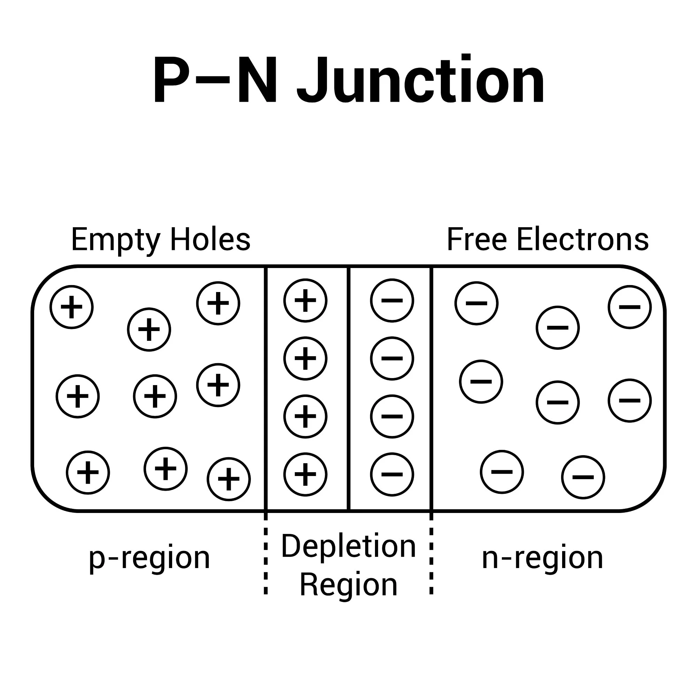

A **PN junction** is formed by bringing together p-type and n-type semiconductor materials. These semiconductors have distinct properties due to their doping:

- **P-Type:** Contains an excess of holes (majority carriers) and a few electrons (minority carriers) due to trivalent impurities (e.g., boron in silicon).
- **N-Type:** Contains an excess of electrons (majority carriers) and a few holes (minority carriers) due to pentavalent impurities (e.g., phosphorus in silicon).

When these materials join, two fundamental processes occur:
1. **Diffusion:** Majority carriers diffuse across the junction due to concentration gradients.
2. **Drift:** An electric field develops that causes drift of carriers in the opposite direction. Drift flow of current is in the opposite direction to diffusion current. Hole current Jp is given by 

total current is sum of hole and electron currents. Also for electrons the current is given above.

## Key Concepts and Physical Mechanisms

### 1. Formation of Depletion Region

When p-type and n-type semiconductors make contact:
- Electrons diffuse from n-type to p-type region, leaving behind immobile positive donor ions.
- Holes diffuse from p-type to n-type region, leaving behind immobile negative acceptor ions.
- This creates a **depletion region** (space charge region) containing immobile ionic charges.
- The exposed immobile ions create an internal **electric field** (E-field) that opposes further diffusion.

### 2. Electric Field and Charge Distribution

The electric field in the depletion region varies with position. Assume a PN junction at x=0,n-type material for x<0 and p-type material for x>0.Depletion region, extends from -Xn to 0 and 0 to Xp.
Electric field can be calculated using poisson's equation . 

### 3. Current-Voltage Characteristics
When Va > 0, the device is said to be forward biased as external field opposes the built-in field and allows the diffusion current (majority carriers) to dominate the PN junction current .We can approximate it by the following equation called diode equation.

#### Forward Bias , Reverse bias

### 4. Junction Capacitance

Capacitive effects in a PN junction arise due to the storage of charge when the voltage across the junction changes. These capacitances are classified into two types:

---

#### 1. Depletion Capacitance
- The **Depletion Capacitance** occurs due to the charge stored in the depletion layer.
- When the reverse bias voltage across the PN junction changes, the width of the depletion region also changes, which alters the stored charge.

#### 2. Diffusion Capacitance
- The **Diffusion Capacitance** arises due to the minority carrier charge stored in the neutral regions of the PN junction under **forward bias** conditions.
- When a voltage is applied, minority carriers are injected into the neutral regions, establishing a charge gradient.

| Capacitance Type     | Condition       | Stored Charge             | Dominates in        |
|---------------------|----------------|--------------------------|--------------------|
| **Depletion Capacitance** | Reverse Bias | Charge in depletion layer | Reverse bias operation |
| **Diffusion Capacitance**  | Forward Bias | Minority carrier charge    | Forward bias operation |

---

---

### 6. Temperature Effects

| Feature                   | Effect with Temperature Increase | Explanation                          |
|----------------------------|----------------------------------|-------------------------------------|
| **Built-in Potential**      | Decreases                      | Higher \( n \) reduces potential barrier |
| **Reverse Saturation Current** | Increases Exponentially        | Higher \( n*n \) generates more leakage current |
| **Bandgap Energy**          | Decreases                      | Lattice vibrations weaken atomic bonds |
| **Carrier Mobility**         | Decreases                      | More phonon scattering |
| **Diffusion Coefficient**     | Slightly Increases            | kT  rise partially compensates for lower mobility |

---

## Applications

PN junctions are fundamental to:
1. **Rectification:** AC to DC conversion
2. **Signal Detection:** Small-signal detection and mixing
3. **Voltage Regulation:** Using breakdown characteristics
4. **Photodetection:** Converting light to electrical signals
5. **Light Emission:** LEDs and laser diodes

## Diagrams

### 1. Formation of Depletion Region and Electric Field and Charge Density

