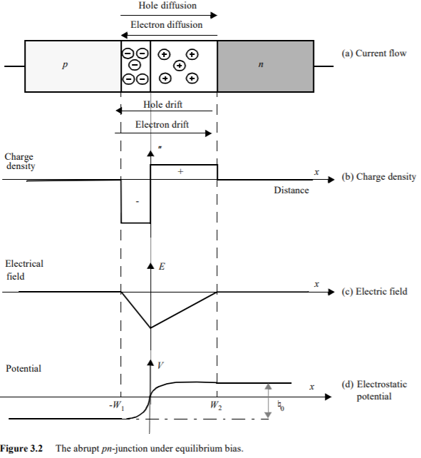

# PN Junction Theory and Mechanisms

## Theory

A **PN junction** is formed by bringing together p-type and n-type semiconductor materials. These semiconductors have distinct properties due to their doping:

- **P-Type:** Contains an excess of holes (majority carriers) and a few electrons (minority carriers) due to trivalent impurities (e.g., boron in silicon).
- **N-Type:** Contains an excess of electrons (majority carriers) and a few holes (minority carriers) due to pentavalent impurities (e.g., phosphorus in silicon).

When these materials join, two fundamental processes occur:
1. **Diffusion:** Majority carriers diffuse across the junction due to concentration gradients.
2. **Drift:** An electric field develops that causes drift of carriers in the opposite direction. Drift flow of current is in the opposite direction to diffusion current.

## Key Concepts and Physical Mechanisms

### 1. Formation of Depletion Region

When p-type and n-type semiconductors make contact:
- Electrons diffuse from n-type to p-type region, leaving behind immobile positive donor ions.
- Holes diffuse from p-type to n-type region, leaving behind immobile negative acceptor ions.
- This creates a **depletion region** (space charge region) containing exposed ionic charges.
- The exposed ions create an internal **electric field** (E-field) that opposes further diffusion.

### 2. Electric Field and Charge Distribution

The electric field in the depletion region varies with position. For an abrupt junction:

### 3. Current-Voltage Characteristics

#### Forward Bias , Reverse bias

### 4. Junction Capacitance

### 5. Capacitive Effects in the PN Junction

Capacitive effects in a PN junction arise due to the storage of charge when the voltage across the junction changes. These capacitances are classified into two types:

---

#### 1. Depletion Capacitance
- The **Depletion Capacitance** (\( C_d \)) occurs due to the charge stored in the depletion layer.
- When the reverse bias voltage across the PN junction changes, the width of the depletion region also changes, which alters the stored charge.
- The depletion capacitance is given by:

\[
C_d = \frac{dQ}{dV}
\]

where:

- \( Q \) is the charge stored in the depletion region
- \( V \) is the applied voltage

For an abrupt PN junction, the depletion capacitance is approximately:

\[
C_d = \varepsilon \frac{A}{W}
\]

where:

- \( \varepsilon \) = Permittivity of the semiconductor
- \( A \) = Cross-sectional area of the junction
- \( W \) = Width of the depletion region

---

#### 2. Diffusion Capacitance
- The **Diffusion Capacitance** (\( C_{diff} \)) arises due to the minority carrier charge stored in the neutral regions of the PN junction under **forward bias** conditions.
- When a voltage is applied, minority carriers are injected into the neutral regions, establishing a charge gradient.

The diffusion capacitance is given by:

\[
C_{diff} = \frac{dQ_{minority}}{dV}
\]

It can be approximated as:

\[
C_{diff} \approx \frac{\tau I}{V_T}
\]

where:

- \( \tau \) = Minority carrier lifetime
- \( I \) = Forward current
- \( V_T = \frac{kT}{q} \) is the thermal voltage

---

### Comparison Table

| Capacitance Type     | Condition       | Stored Charge             | Dominates in        |
|---------------------|----------------|--------------------------|--------------------|
| **Depletion Capacitance** | Reverse Bias | Charge in depletion layer | Reverse bias operation |
| **Diffusion Capacitance**  | Forward Bias | Minority carrier charge    | Forward bias operation |

---

### Diagram

---

### 6. Temperature Effects

| Feature                   | Effect with Temperature Increase | Explanation                          |
|----------------------------|----------------------------------|-------------------------------------|
| **Built-in Potential**      | Decreases                      | Higher \( n \) reduces potential barrier |
| **Reverse Saturation Current** | Increases Exponentially        | Higher \( n*n \) generates more leakage current |
| **Bandgap Energy**          | Decreases                      | Lattice vibrations weaken atomic bonds |
| **Carrier Mobility**         | Decreases                      | More phonon scattering |
| **Diffusion Coefficient**     | Slightly Increases            | kT  rise partially compensates for lower mobility |

---

## Applications

PN junctions are fundamental to:
1. **Rectification:** AC to DC conversion
2. **Signal Detection:** Small-signal detection and mixing
3. **Voltage Regulation:** Using breakdown characteristics
4. **Photodetection:** Converting light to electrical signals
5. **Light Emission:** LEDs and laser diodes

## Diagrams

### 1. Formation of Depletion Region

### 2. Electric Field and Charge Density
